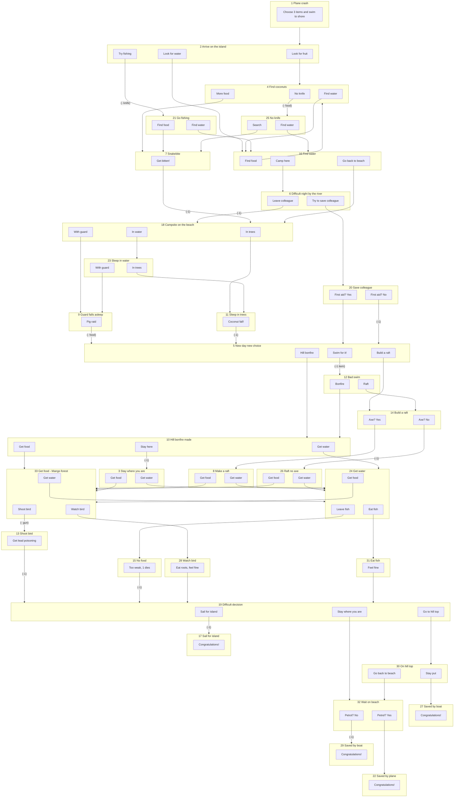

```mermaid
flowchart

    subgraph card1 [1 Plane crash]
    id1[Choose 3 items and swim to shore]
    end
    subgraph card2 [2 Arrive on the island]
    id2[Look for fruit]
    id3[Try fishing]
    id4[Look for water]
    end
    subgraph card3 [3 Stay where you are]
    id5[Get water]
    id6[Get food]
    end
    subgraph card4 [4 Find coconuts]
    id7[No knife]
    id8[Find water]
    id9[More food]
    end
    subgraph card5 [5 New day new choice]
    id10[Hill bonfire]
    id11[Build a raft]
    id12[Swim for it!]
    end
    subgraph card6 [6 Difficult night by the river]
    id13[Leave colleague]
    id14[Try to save colleague]
    end
    subgraph card7 [7 Snakebite]
    id15[Get bitten!]
    end
    subgraph card8 [8 Make a raft]
    id16[Get water]
    id17[Get food]
    end
    subgraph card9 [9 Guard falls asleep]
    id18[Pig raid]
    end
    subgraph card10 [10 Hill bonfire made]
    id19[Get water]
    id20[Get food]
    id21[Stay here]
    end
    subgraph card11 [11 Sleep in trees]
    id22[Coconut fall!]
    end
    subgraph card12 [12 Bad swim]
    id23[Bonfire]
    id24[Raft]
    end
    subgraph card13 [13 Shoot bird]
    id25[Get lead poisoning]
    end
    subgraph card14 [14 Build a raft]
    id26[Axe? Yes]
    id27[Axe? No]
    end
    subgraph card15 [15 No food]
    id28[Too weak, 1 dies]
    end
    subgraph card16 [16 Find water]
    id29[Find food]
    id30[Camp here]
    id31[Go back to beach]
    end
    subgraph card17 [17 Sail for island]
    id32[Congratulations!]
    end
    subgraph card18 [18 Campsite on the beach]
    id33[In trees]
    id34[With guard]
    id35[In water]
    end
    subgraph card19 [19 Difficult decision]
    id36[Sail for island]
    id37[Stay where you are]
    id38[Go to hill top]
    end
    subgraph card20 [20 Save colleague]
    id39[First aid? Yes]
    id40[First aid? No]
    end
    subgraph card21 [21 Go fishing]
    id41[Find food]
    id42[Find water]
    end
    subgraph card22 [22 Saved by plane]
    id43[Congratulations!]
    end
    subgraph card23 [23 Sleep in water]
    id44[In trees]
    id45[With guard]
    end
    subgraph card24 [24 Get water]
    id46[Eat fish]
    id47[Leave fish]
    id48[Get food]
    end
    subgraph card25 [25 No knife]
    id49[Find water]
    id50[Search]
    end
    subgraph card26 [26 Raft no axe]
    id51[Get water]
    id52[Get food]
    end
    subgraph card27 [27 Saved by boat]
    id53[Congratulations!]
    end
    subgraph card28 [28 Watch bird]
    id54[Eat roots, feel fine]
    end
    subgraph card29 [29 Saved by boat]
    id55[Congratulations!]
    end
    subgraph card30 [30 On hill top]
    id56[Stay put]
    id57[Go back to beach]
    end
    subgraph card31 [31 Eat fish]
    id58[Feel fine]
    end
    subgraph card32 [32 Wait on beach]
    id59[Petrol? Yes]
    id60[Petrol? No]
    end
    subgraph card33 [33 Get food - Mango forest]
    id61[Shoot bird]
    id62[Watch bird]
    id63[Get water]
    end

    card1 ---> card2
    id2 ---> card4
    id3 --(- knife)--> card21
    id4 ---> card16
    id5 ---> card24
    id6 ---> card33
    id7 --(- food)--> card25
    id8 ---> card16
    id9 ---> card7
    id10 ---> card10
    id11 ---> card14
    id12 --(-1 item)--> card12
    id13 --(-1)--> card18
    id14 ---> card20
    id15 --(-1)--> card18
    id16 ---> card24
    id17 ---> card33
    id18 --(- food)--> card5
    id19 ---> card24
    id20 ---> card33
    id21 --(-1)--> card3
    id22 --(-1)--> card5
    id23 ---> card10
    id24 ---> card14
    id25 --(-1)--> card19
    id26 ---> card8
    id27 --(-1)--> card26
    id28 --(-1)--> card19
    id29 ---> card4
    id30 ---> card6
    id31 ---> card18
    id33 ---> card11
    id34 ---> card9
    id35 ---> card23
    id36 --(-1)--> card17
    id37 ---> card32
    id38 ---> card30
    id39 ---> card5
    id40 --(-1)--> card5
    id41 ---> card7
    id42 ---> card16
    id44 ---> card11
    id45 ---> card9
    id46 ---> card31
    id47 ---> card15
    id48 ---> card33
    id49 ---> card16
    id50 ---> card7
    id51 ---> card24
    id52 ---> card33
    id54 ---> card19
    id56 ---> card27
    id57 ---> card32
    id58 ---> card19
    id59 ---> card22
    id60 --(-1)--> card29
    id61 --(- gun)--> card13
    id62 ---> card28
    id63 ---> card24

```

